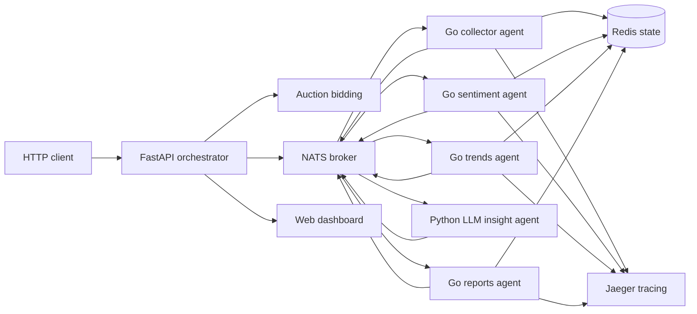

# Лабораторная работа №13

ФИО: Мельникова Анастасия
ФИО (полностью): Мельникова Анастасия
Группа: 220032-11
Лабораторная работа: 13
Номер лабораторной: 13
Номер лабораторной работы: 13
Вариант: 13
Номер варианта: 13
Сложность: повышенная
Уровень сложности: повышенная
Тип варианта: повышенная сложность

FIO: Melnikova Anastasia
Group: 220032-11
Lab: 13
Variant: 13
Difficulty: advanced

## Информация о студенте

- ФИО: Мельникова Анастасия
- Группа: 220032-11
- Номер лабораторной работы: 13
- Номер варианта: 13
- Тип варианта: повышенная сложность
- Предметная область: анализ социальных сетей

## Описание программы

Проект реализует мультиагентную систему для анализа социальных сетей. Оркестратор на Python управляет pipeline обработки, Go-агенты выполняют основные этапы анализа, а отдельный Python LLM-агент добавляет интеллектуальную интерпретацию трендов:

1. `collector` собирает демонстрационные посты по теме.
2. `sentiment` анализирует тональность публикаций.
3. `trends` выявляет часто встречающиеся темы.
4. `llm` формирует аналитический вывод через Ollama, cloud-compatible API или deterministic fallback.
5. `reports` формирует итоговый Markdown-отчёт.

Коммуникация между компонентами выполняется через NATS request/reply. Redis хранит состояние агентов и счётчики обработанных задач. Jaeger подключён для распределённой трассировки, а FastAPI предоставляет REST API и веб-панель мониторинга.

## Используемые технологии

- Go 1.22: универсальный микросервис агента, `nats.go`, Redis state store, graceful shutdown.
- Python 3.12+: FastAPI, asyncio, `nats-py`, Pydantic, JWT-аутентификация.
- Python LLM-agent: `nats-py`, `httpx`, поддержка Ollama и облачного API.
- NATS: брокер сообщений для взаимодействия агентов.
- Redis: персистентное состояние и метрики агентов.
- Jaeger / OpenTelemetry: трассировка прохождения задач.
- Docker Compose: локальный запуск распределённой системы.
- Pytest и Go testing: модульные тесты бизнес-логики, retry, timeout и validation cases.

## Архитектура



Исходный код находится в `src/`, тесты находятся в `tests/`. Go-агент сделан универсальным: роль, правила поведения, стоимость в аукционе и специализация задаются JSON-конфигами в `src/go-agent/configs/`. LLM-агент находится в `src/llm-agent` и является отдельным Python-сервисом.

## Сборка проекта

Скопировать пример окружения:

```powershell
Copy-Item .env.example .env
```

Собрать все контейнеры:

```powershell
docker compose build
```

Локальная проверка без Docker:

```powershell
cd src/go-agent
go test ./...

cd ..\..\src\orchestrator
python -m pip install -r requirements.txt
cd ..\..
pytest tests\python
```

## Запуск

Запуск всей системы:

```powershell
docker compose up --build
```

Сервисы после запуска:

- API оркестратора: `http://localhost:8000`
- Swagger UI: `http://localhost:8000/docs`
- Dashboard: `http://localhost:8000/dashboard`
- Jaeger UI: `http://localhost:16686`
- NATS monitoring: `http://localhost:8222`

По умолчанию `LLM_PROVIDER=mock`, поэтому система запускается без ключей и без локальной модели. Для Ollama можно указать:

```powershell
$env:LLM_PROVIDER="ollama"
$env:OLLAMA_URL="http://host.docker.internal:11434"
$env:OLLAMA_MODEL="llama3.1"
docker compose up --build
```

Для облачного провайдера используется режим `LLM_PROVIDER=cloud`, `CLOUD_LLM_API_URL` и `CLOUD_LLM_API_KEY`.

## Примеры запросов

API `/api/analyze` защищён JWT. Для локального примера можно сгенерировать токен тем же секретом, который указан в `.env`:

```powershell
python -c "import jwt, datetime; print(jwt.encode({'sub':'student','scopes':['run:analysis'],'exp':datetime.datetime.now(datetime.UTC)+datetime.timedelta(hours=1)}, 'change-me-in-local-env', algorithm='HS256'))"
```

Запуск анализа:

```powershell
curl -X POST http://localhost:8000/api/analyze `
  -H "Content-Type: application/json" `
  -H "Authorization: Bearer <TOKEN>" `
  -d "{\"query\":\"качество сервиса в соцсетях\",\"limit\":5,\"networks\":[\"telegram\",\"vk\"]}"
```

Получение технической трассировки событий:

```powershell
curl http://localhost:8000/api/traces
```

Проверка здоровья API:

```powershell
curl http://localhost:8000/healthz
```

## Масштабирование и аукцион

Дополнительные экземпляры агента можно запускать стандартным механизмом Docker Compose:

```powershell
docker compose up --scale sentiment-agent=3 --scale trends-agent=2 --scale llm-agent=2
```

Перед каждым этапом оркестратор отправляет auction request на тему `social.auction.<role>`. Агент возвращает стоимость, рассчитанную по базовой цене, релевантности ключевых слов и текущей нагрузке. Затем задача отправляется в соответствующую очередь NATS, где несколько экземпляров одного типа распределяют работу через queue group. Для LLM-агента стоимость зависит от наличия трендов, текущей нагрузки и выбранного провайдера.

## Тестирование

Запуск всех тестов:

```powershell
make test
```

Или отдельно:

```powershell
cd src/go-agent
go test ./...

cd ..\..
pytest tests\python
```

Тесты покрывают:

- обработку постов, тональности и аукционной стоимости в Go;
- успешный pipeline с LLM-шагом;
- генерацию prompt и deterministic fallback для LLM-агента;
- retry после timeout;
- ошибку после исчерпания попыток;
- Pydantic validation errors;
- успешную и неуспешную JWT-аутентификацию.
